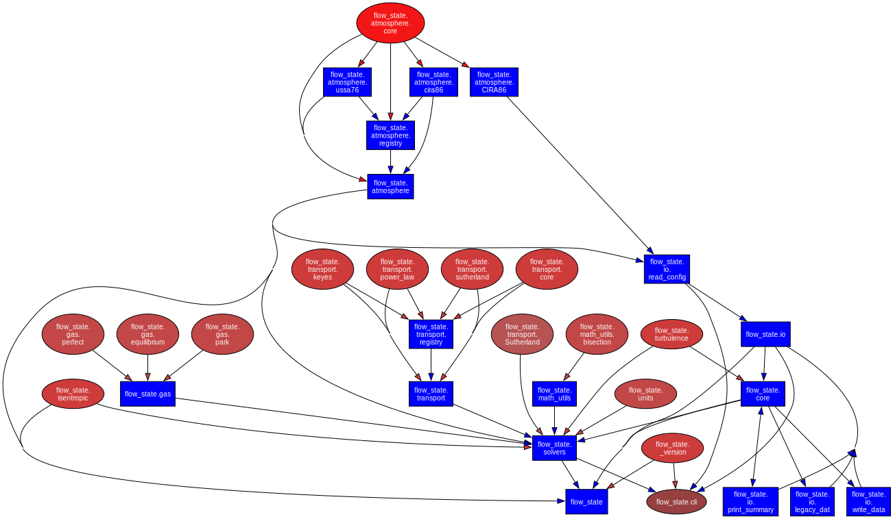

# Package Architecture

Visual overview of the `flow_state` module structure and data flow.

## Module Dependency Graph



[Download architecture (SVG)](../assets/architecture.svg){ .md-button download="flow_state_architecture.svg" }
[View in browser](../assets/architecture.svg){ .md-button target="_blank" }

??? info "Regenerate"

    ```bash
    pydeps src/flow_state --noshow --max-bacon=4 --cluster -o docs/assets/architecture.svg
    ```
