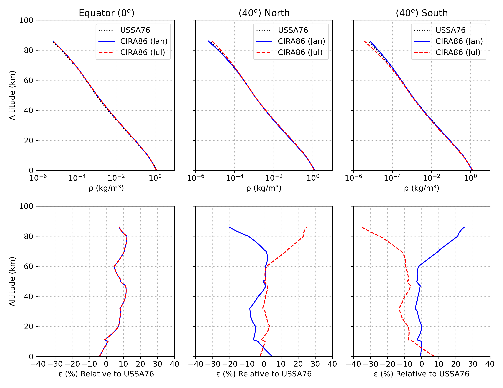
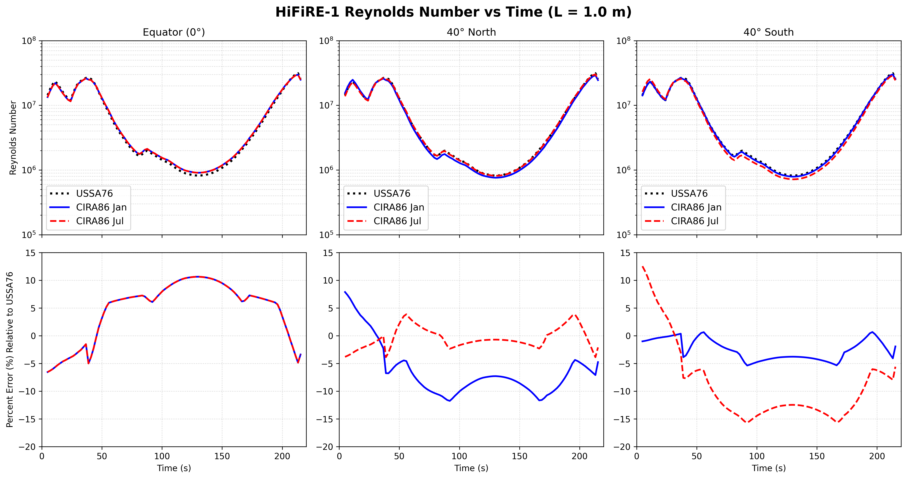

# Atmosphere Comparison

!!! warning "Under Construction"
    This page is incomplete.

## Atmosphere Model Temperature Comparison

## Atmosphere Model Density Comparison




## Reproducing These Plots

The figures were generated with:

```bash
python scripts/temp_graph_atmosphere_models.py   # T
python scripts/generate_latitude_grid.py       # CIRA86 latitude schematic
```

## Sample Trajectory Calculation

Sample Trajectory 1: HIFIRE-1 Flight Experiment 2007 (Kimmel)


Sample Trajectory 2


