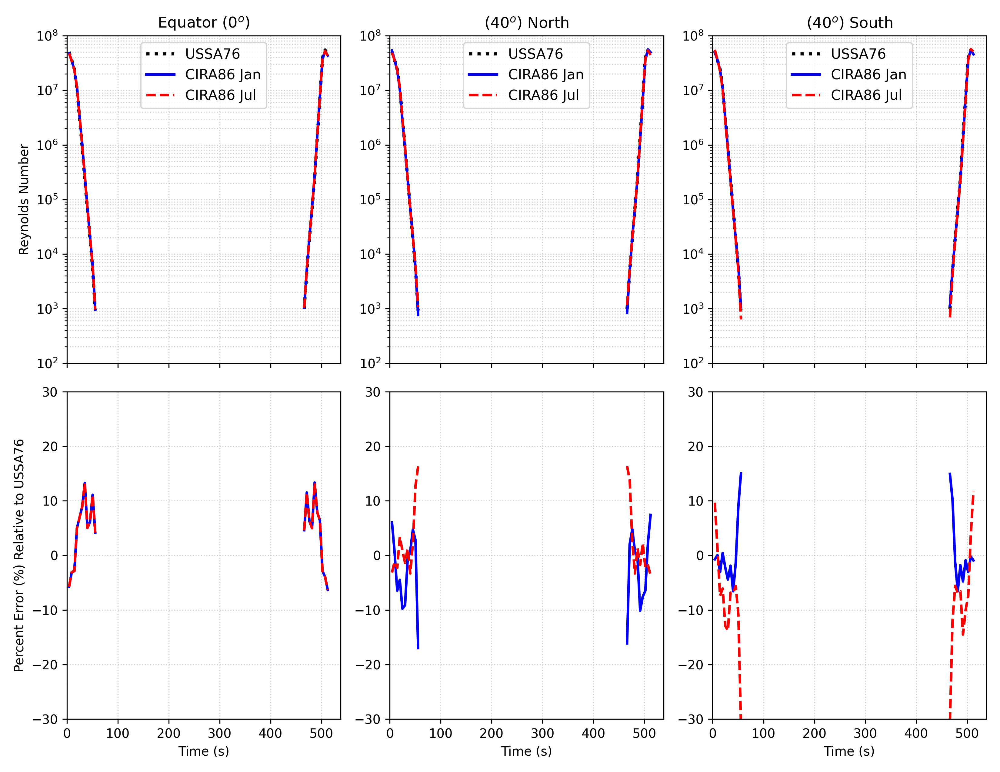

# Atmosphere Comparison

!!! warning "Under Construction"
    This page is incomplete.


## Reproducing These Plots

The figures were generated with:

```bash
python scripts/generate_atmosphere_plots.py   # T, p, rho comparison
python scripts/generate_latitude_grid.py       # CIRA86 latitude schematic
```

## Sample Trajectory Calculation
